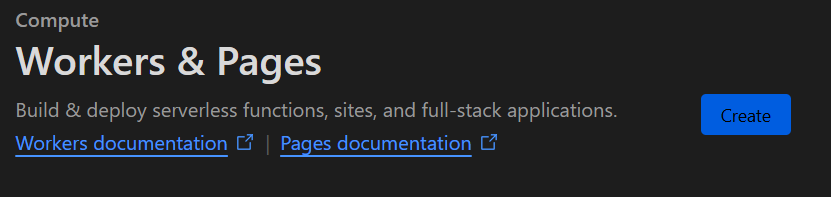
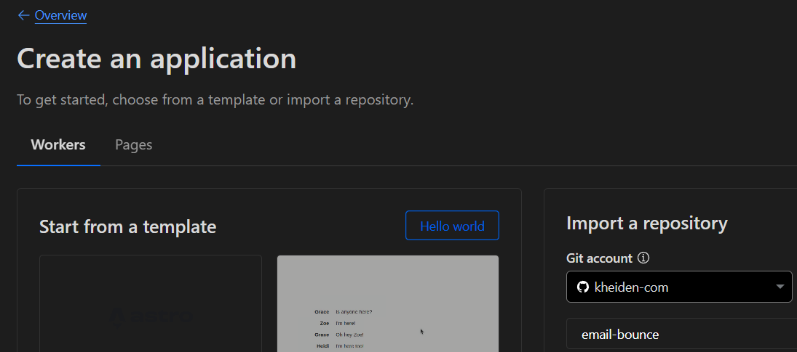
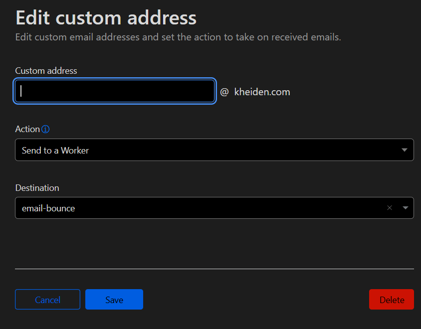
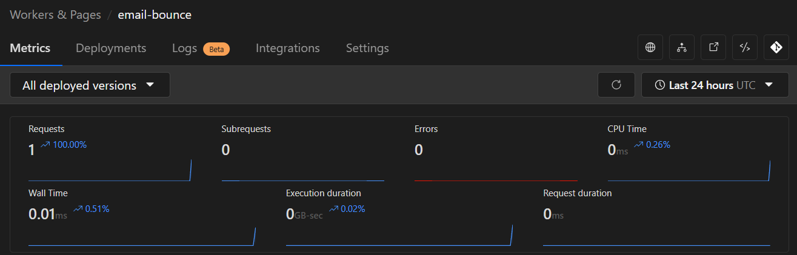
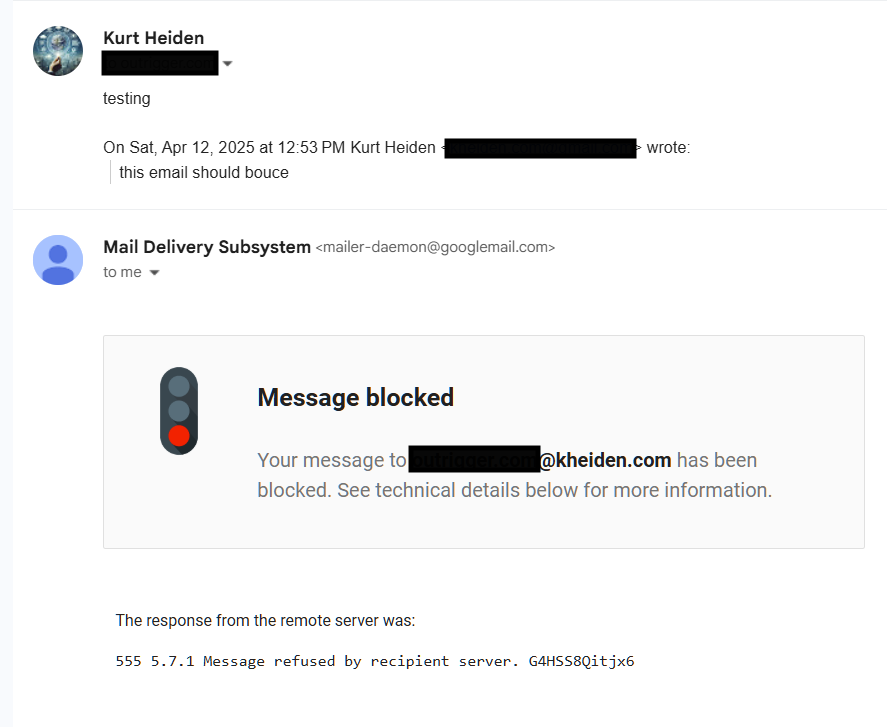
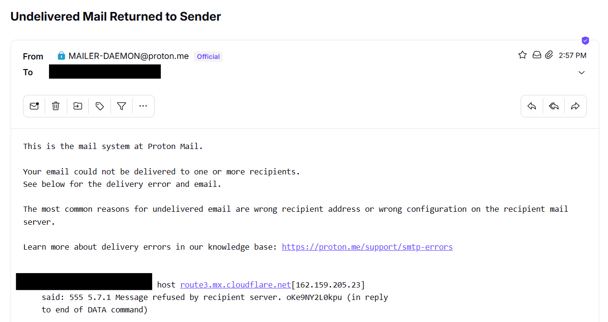

# Email Bounce for Cloudflare Worker

This Cloudflare worker can provide a bounce response when attached to an email address.

## Deploy worker to Cloudflare - CLI

To create a new Cloudflare worker named "email-bounce", run the following:

```
npm install
npm run deploy
```

## Deploy worker to Cloudflare - UI
0) Fork this repository
1) Create a new worker


2) Import the repository


3) Use the default name 'email-bounce' or select a new name. Keep the default build command of `npx wrangler deploy`.
4) Create the worker


### Configure Cloudflare email route

The inbound cloudflare email address needs to be directed to the newly create worker. This can be done via the user interface at the following URL:

```
https://dash.cloudflare.com/[uuid]/[domain]/email/routing/routes
```
Email address route being created and assigned to `email-bounce`:





### Results

Sending an email from gmail



Sending an email from protonmail

